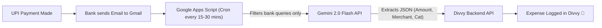

# 💡 Divvy — Future Feature Ideas & Architecture Roadmap

This document serves as the master backlog and architectural blueprint for all advanced ideas, automation workflows, and feature concepts discussed for the Divvy platform.

---

## 📑 Table of Contents
1. [🍽️ Smart Itemized Bill & Dining Splitter](#1-smart-itemized-bill--dining-splitter)
2. [📱 Bank SMS & Push Notification Interception](#2-bank-sms--push-notification-interception)
3. [✉️ Zero-Touch Email Transaction Sync (Gmail + Gemini)](#3-zero-touch-email-transaction-sync-gmail--gemini)
4. [📄 Bank Statement PDF / CSV Bulk Importer](#4-bank-statement-pdf--csv-bulk-importer)
5. [🏦 India Account Aggregator (AA) Integration](#5-india-account-aggregator-aa-integration)

---

## 1. 🍽️ Smart Itemized Bill & Dining Splitter

### 💡 The Problem
When a group goes out to eat (e.g., 5 friends, total bill ₹5,000), one person pays upfront. Splitting equally (₹1,000 each) is unfair if:
- **Person 1** only ordered a soup (₹340).
- **Person 2** ordered premium steak and cocktails (₹2,000).
- Taxes (GST), service charges, and tips need to be proportionally distributed.

### 🛠️ Proposed Solution & Logic
1. **Receipt Photo / OCR Upload**:
   - User snaps a photo of the restaurant bill.
   - **Gemini AI Vision** extracts individual line items, prices, discounts, taxes (CGST + SGST), and service charge.
2. **Item-to-Person Assignment UI**:
   - Interactive modal listing all items with participant avatar badges.
   - Members tap items they consumed (supports shared items, e.g., an appetizer split between 2 people).
3. **Proportional Tax & Tip Calculation Engine**:
   $$\text{Tax Ratio} = \frac{\text{Member Subtotal}}{\text{Total Food Subtotal}}$$
   $$\text{Member Share} = \text{Member Subtotal} + (\text{Tax Ratio} \times \text{Total Taxes \& Service Charges})$$
4. **Output**: Converts directly into a Divvy Group Expense with an **Exact Split** breakdown.

---

## 2. 📱 Bank SMS & Push Notification Interception

### 💡 The Problem
Users make dozens of UPI payments daily (via GPay, PhonePe, Paytm). Manually entering each ₹20 chai or ₹350 lunch is tedious. Every bank sends a real-time transactional SMS (`A/c XX1234 debited by Rs. 450.00 on ... to SWIGGY UPI Ref ...`).

### 🛠️ Platform Feasibility & Implementation Strategy

| Platform | Feasibility | Implementation Path |
| :--- | :--- | :--- |
| **Android (Native APK / React Native)** | ✅ **100% Automated** | Uses `NotificationListenerService` or `RECEIVE_SMS` broadcast receiver to intercept bank alerts in the background and POST directly to Divvy's `/api/personal-expenses`. |
| **Web Browser (Desktop / Mobile)** | ⚠️ **Security Sandboxed** | Browsers strictly forbid websites from reading device SMS for security/OTP protection. |
| **iOS (iPhone)** | ❌ **Blocked by Apple** | Apple prohibits all 3rd-party apps from reading SMS. |

### 🚀 Divvy Web Solutions:
1. **"Smart SMS Paste" Quick-Add Modal**:
   - User copies bank debit SMS from notification drawer.
   - Pastes into Divvy's Quick-Add box (or clicks a 1-tap "Paste Clipboard" button).
   - Divvy sends text to Gemini AI (`POST /api/ai/parse-expense`).
   - Gemini automatically extracts: `Amount`, `Merchant`, `Category`, `Date`, and `Payment Mode` (UPI) in milliseconds.
2. **PWA Web Share Target**:
   - On mobile browsers, users tap "Share" on any SMS message and pick "Divvy" to log instantly.

---

## 3. ✉️ Zero-Touch Email Transaction Sync (Gmail + Gemini)

### 💡 The Problem
For users who want **100% automation with ZERO manual work**, copying SMS or opening the app is still an extra step.

### 🛠️ Proposed Automated Architecture (Google Apps Script + Gemini Flash)



#### Key Architecture Details:
1. **Strict Privacy Filter**:
   - Script runs directly inside the user's Google Account.
   - Searches only bank alerts:
     ```text
     from:(alerts@hdfcbank.net OR alerts@icicibank.com OR sbi.co.in) "debited" is:unread
     ```
   - **Gemini NEVER sees personal, work, or social emails.**
2. **Gemini Extraction Schema**:
   ```json
   {
     "title": "Merchant / Recipient Name",
     "amount": 0.00,
     "category": "Food & Dining | Transport | Shopping | Bills",
     "payment_method": "UPI",
     "date": "YYYY-MM-DD",
     "reference_id": "Bank UTR / UPI Ref"
   }
   ```
3. **Deduplication Engine**:
   - Divvy's backend stores the bank `reference_id` or transaction hash.
   - Prevents duplicate logging if emails are re-scanned.

#### Alternative: In-App "Connect Gmail"
- Divvy Settings includes an OAuth button: **"Connect Gmail for Bank Sync"**.
- FastAPI backend runs a background Celery / asyncio cron to periodically query the Gmail API using `gmail.readonly` scope.

---

## 4. 📄 Bank Statement PDF / CSV Bulk Importer

### 💡 The Problem
Users adopting Divvy want to import their entire last month or year of spending without entering historical expenses one-by-one.

### 🛠️ Proposed Solution:
1. **Drag-and-Drop Statement Box**:
   - Supports monthly bank statement PDFs (HDFC, ICICI, SBI, Axis, Kotak) or UPI export CSVs (GPay, Paytm).
2. **Password-Protected PDF Handling**:
   - Most bank PDFs are password-encrypted with standard formats (e.g. PAN + DOB). Modal provides a secure single-use prompt to decrypt.
3. **Gemini Bulk Parser**:
   - Extracts all rows into a staging table.
   - Highlights suspected duplicates against existing expenses.
   - 1-Click "Import All (48 transactions)" with auto-categorization.

---

## 5. 🏦 India Account Aggregator (AA) Integration

### 💡 The Enterprise Approach
The Reserve Bank of India (RBI) Account Aggregator framework (e.g., Setu, Finvu, OneMoney, Anumati) enables regulated, 100% legal, consent-driven bank statement syncing directly from bank servers without needing SMS or email scrapers.

- **How it works**: User enters their mobile number, selects their banks, approves an OTP-based consent request, and Divvy receives encrypted financial information directly via certified AA APIs.
- **Suitability**: Ideal for future production / commercial scale.

---

*Last Updated: September 2026 | Divvy Product Strategy*
