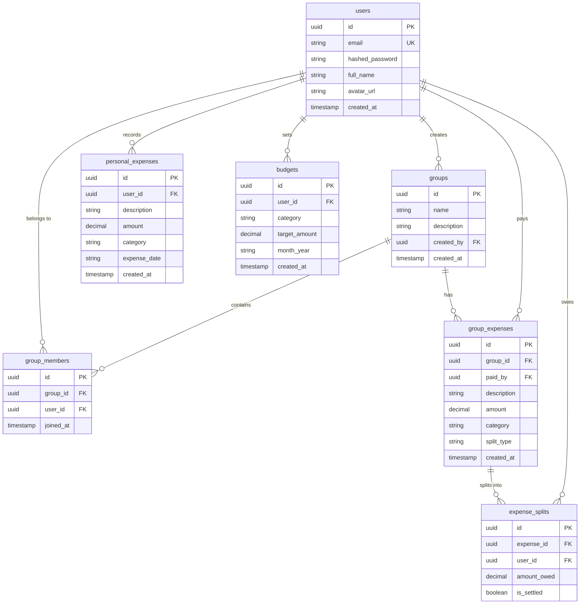

# 📘 Divvy - Complete Codebase Architecture, File-by-File Guide & Workflow Documentation

This document is an exhaustive, line-by-line structural reference for **Divvy** — a full-stack, real-time Expense Splitting & Personal Finance Management Web Application.

---

## 📑 Master Table of Contents
1. [Executive Overview & System Architecture](#1-executive-overview--system-architecture)
2. [End-to-End System Workflows & File Interactions](#2-end-to-end-system-workflows--file-interactions)
   - [Workflow A: User Authentication & JWT Session Setup](#workflow-a-user-authentication--jwt-session-setup)
   - [Workflow B: Creating a Group & Inviting Members](#workflow-b-creating-a-group--inviting-members)
   - [Workflow C: Adding & Splitting a Group Expense](#workflow-c-adding--splitting-a-group-expense)
   - [Workflow D: Debt Simplification & Settlement](#workflow-d-debt-simplification--settlement)
   - [Workflow E: Personal Expense Tracking & Budget Caps](#workflow-e-personal-expense-tracking--budget-caps)
   - [Workflow F: Month Navigation & Yearly Horizon Analysis](#workflow-f-month-navigation--yearly-horizon-analysis)
3. [Exhaustive File-by-File Breakdown](#3-exhaustive-file-by-file-breakdown)
   - [Category 1: Project Root & Deployment Configurations](#category-1-project-root--deployment-configurations)
   - [Category 2: Backend Core & Infrastructure](#category-2-backend-core--infrastructure)
   - [Category 3: Backend Database Models (`backend/app/models/`)](#category-3-backend-database-models-backendappmodels)
   - [Category 4: Backend Pydantic Schemas (`backend/app/schemas/`)](#category-4-backend-pydantic-schemas-backendappschemas)
   - [Category 5: Backend Business Services & Algorithms (`backend/app/services/`)](#category-5-backend-business-services--algorithms-backendappservices)
   - [Category 6: Backend REST API Routers (`backend/app/routers/`)](#category-6-backend-rest-api-routers-backendapprouters)
   - [Category 7: Frontend Core & App Layout](#category-7-frontend-core--app-layout)
   - [Category 8: Frontend Reusable UI Components (`frontend/src/components/common/`)](#category-8-frontend-reusable-ui-components-frontendsrccomponentscommon)
   - [Category 9: Frontend Axios HTTP Services Layer (`frontend/src/services/`)](#category-9-frontend-axios-http-services-layer-frontendsrcservices)
   - [Category 10: Frontend Zustand State Stores (`frontend/src/store/`)](#category-10-frontend-zustand-state-stores-frontendsrcstore)
   - [Category 11: Frontend Page Views (`frontend/src/pages/`)](#category-11-frontend-page-views-frontendsrcpages)
   - [Category 12: Frontend CSS Design System (`frontend/src/styles/`)](#category-12-frontend-css-design-system-frontendsrcstyles)
4. [Database Schema & Entity Relationship Model](#4-database-schema--entity-relationship-model)

---

## 1. 🏗️ Executive Overview & System Architecture

Divvy is structured as a **decoupled Client-Server Architecture**:
- **Frontend**: Single Page Application (SPA) built with React 18, Vite, Zustand (for state management), and Vanilla CSS (Cyberpunk dark aesthetic design system).
- **Backend**: Asynchronous REST API built with FastAPI (Python 3.12), Pydantic (data validation), SQLAlchemy 2.0 (ORM), and Uvicorn (ASGI web server).
- **Database**: PostgreSQL database hosted on Supabase.

```
+-----------------------------------------------------------------------------------+
|                                  REACT SPA FRONTEND                               |
|  [Pages: Dashboard, Groups, Personal, Analytics] <--> [Zustand Global State Stores]|
|                                         |                                         |
|                                (Axios API Client)                                 |
|                                         |                                         |
+-----------------------------------------|-----------------------------------------+
                                          | HTTP REST (JSON + JWT Bearer Token)
+-----------------------------------------|-----------------------------------------+
|                                  FASTAPI BACKEND                                  |
|   [Routers: auth, groups, expenses, personal, budgets]                            |
|                            |                                                      |
|                   [Auth Middleware] (JWT Verification)                            |
|                            |                                                      |
|                [Services: split_service, auth_service]                            |
|                            |                                                      |
|                   [SQLAlchemy ORM Data Models]                                    |
+------------------------------------|----------------------------------------------+
                                     | SQL Database Connection
+------------------------------------|----------------------------------------------+
|                              SUPABASE POSTGRES DB                                 |
|   (tables: users, groups, group_members, group_expenses, expense_splits, ...)     |
+-----------------------------------------------------------------------------------+
```

---

## 2. ⚡ End-to-End System Workflows & File Interactions

### Workflow A: User Authentication & JWT Session Setup
1. **User Input**: User enters credentials into `LoginPage.jsx`.
2. **Component Trigger**: `LoginPage.jsx` calls `login()` from `authStore.js`.
3. **Axios Dispatch**: `authStore.js` executes `authService.login()` in `authService.js`.
4. **HTTP Request**: `api.js` sends `POST /api/auth/login` to FastAPI.
5. **Router Handling**: `backend/app/routers/auth.py` validates inputs using `UserLogin` schema in `schemas/user.py`.
6. **Authentication Verification**: `auth_service.py` fetches `User` model from `database.py`, verifies bcrypt password hash using `passlib`.
7. **Token Generation**: `auth_service.py` generates a signed JWT token containing user ID.
8. **HTTP Response**: FastAPI returns `200 OK` with JSON payload `{ access_token, token_type: "bearer" }`.
9. **State Storage**: `authStore.js` saves `access_token` into browser `localStorage` and updates reactive `user` state.
10. **Global Header Interceptor**: `api.js` automatically attaches `Authorization: Bearer <token>` to all subsequent HTTP requests.

---

### Workflow B: Creating a Group & Inviting Members
1. **User Action**: User submits "Create Group" modal on `GroupsPage.jsx`.
2. **Store Action**: `groupStore.js` calls `groupService.createGroup()` in `groupService.js`.
3. **API Request**: Request sent to `POST /api/groups` on backend.
4. **Backend Processing**: `backend/app/routers/groups.py` extracts current authenticated user via `get_current_user` (`middleware/auth.py`).
5. **Database Transaction**: Router writes a new `Group` record and inserts creator into `GroupMember` table in Supabase.
6. **UI Refresh**: `groupStore.js` appends the newly created group to active groups state array, re-rendering `GroupsPage.jsx` instantly.

---

### Workflow C: Adding & Splitting a Group Expense
1. **User Action**: User clicks "Add Expense" on `GroupsPage.jsx`, selects split mode (**Equal**, **Percentage**, or **Exact Amounts**), inputs amount and participants.
2. **Frontend Validation**: `GroupsPage.jsx` ensures percentages sum to 100% or exact amounts match total cost.
3. **Store Call**: `groupStore.js` calls `groupService.addExpense()`.
4. **HTTP Dispatch**: `POST /api/groups/{group_id}/expenses` sent to `backend/app/routers/expenses.py`.
5. **Backend Processing**:
   - Creates a `GroupExpense` ORM record in `models/expense.py`.
   - Iterates through participants and creates individual `ExpenseSplit` records (`amount_owed`, `is_settled=False`).
6. **Balance Recalculation**: `split_service.py` computes updated balances for all group members.
7. **Response & UI Render**: Backend returns updated expense object. `groupStore.js` recalculates member balances, re-rendering group debt cards.

---

### Workflow D: Debt Simplification & Settlement
1. **Backend Engine**: `backend/app/services/split_service.py` receives all unsettled `ExpenseSplit` records for a group.
2. **Greedy Matching Algorithm**:
   - Sums net balance for each member: `Net = (Total Paid) - (Total Owed)`.
   - Separates members into **Debtors** (Negative Balance) and **Creditors** (Positive Balance).
   - Pairs highest debtor with highest creditor to eliminate debts in minimum possible transaction steps.
3. **User Action**: User clicks "Settle" on `GroupsPage.jsx`.
4. **API Call**: `POST /api/groups/{group_id}/settle` marks underlying `ExpenseSplit` records as `is_settled=True`.
5. **UI Update**: Settled debt cards disappear from the settlement matrix.

---

### Workflow E: Personal Expense Tracking & Budget Caps
1. **User Action**: User inputs a personal expense (e.g. ₹500 for Food) on `PersonalTrackerPage.jsx`.
2. **Store Dispatch**: `personalExpenseStore.js` calls `personalExpenseService.addExpense()`.
3. **HTTP Dispatch**: `POST /api/personal-expenses` sent to `backend/app/routers/personal_expenses.py`.
4. **Database Write**: `PersonalExpense` record created with `user_id`, `description`, `amount`, `category`, and `expense_date`.
5. **Real-time Metrics Update**:
   - `PersonalTrackerPage.jsx` calculates:
     - `Monthly Spent`: Sum of expenses where `expense_date` matches selected month (`2026-08`).
     - `Yearly Spent`: Sum of expenses where `expense_date` matches active year (`2026`).
     - `Remaining Cap`: `Overall Budget Target - Monthly Spent`.
   - Category breakdown cards update progress fill bars and show `Over Budget` alert badges if limit is exceeded.

---

### Workflow F: Month Navigation & Yearly Horizon Analysis
1. **User Action**: User clicks `▶` or `◀` or picks a month from the Month Picker on `PersonalTrackerPage.jsx`.
2. **Timezone-Safe Calculation**: `handleNextMonth` / `handlePrevMonth` updates `selectedMonthYear` state using pure string arithmetic (`2026-08` $\rightarrow$ `2026-09`), avoiding UTC Date timezone shifts.
3. **Filtered View Update**: Expenses feed and category cards instantly re-filter for the target month.
4. **Yearly Horizon Toggle**: User switches view mode to `📈 Yearly Horizon (2026)`.
5. **Annual Projections**: `PersonalTrackerPage.jsx` renders:
   - Total Annual Target: `Overall Monthly Budget * 12`.
   - Cumulative Year Spent: Sum of all expenses across 2026.
   - Estimated Annual Savings: `Max(Annual Target - Yearly Spent, 0)`.
   - 12-Month Interactive Grid: Renders monthly spent totals for Jan–Dec.

---

## 3. 📂 Exhaustive File-by-File Breakdown

---

### Category 1: Project Root & Deployment Configurations

#### 📄 `docker-compose.yml`
- **Path**: `docker-compose.yml`
- **Purpose**: Defines local multi-container containerization for PostgreSQL, FastAPI backend, and Vite React frontend.
- **Key Contents**:
  - `db` service: Runs PostgreSQL 15 image with environment credentials.
  - `backend` service: Builds `backend/Dockerfile`, exposes port 8000, connects to `db`.
  - `frontend` service: Builds `frontend/Dockerfile`, exposes port 5173.
- **Connected To**: `backend/Dockerfile`, `frontend/Dockerfile`.

#### 📄 `backend/Dockerfile`
- **Path**: `backend/Dockerfile`
- **Purpose**: Container definition for building and launching the FastAPI python server.
- **Key Commands**: Installs `requirements.txt`, copies backend application code, executes `uvicorn app.main:app --host 0.0.0.0 --port 8000`.

#### 📄 `frontend/Dockerfile`
- **Path**: `frontend/Dockerfile`
- **Purpose**: Container definition for bundling React frontend via Vite and serving static assets.

#### 📄 `frontend/vite.config.js`
- **Path**: `frontend/vite.config.js`
- **Purpose**: Configuration file for Vite build tool and development server.
- **Key Rules**: Configures React plugin (`@vitejs/plugin-react`) and sets up proxy server directing `/api` backend requests to `http://localhost:8000`.

#### 📄 `frontend/index.html`
- **Path**: `frontend/index.html`
- **Purpose**: HTML template entry point for Vite React application.
- **Key Elements**: Contains root mount point `<div id="root"></div>`, page title, and Google Fonts links (`Inter`, `JetBrains Mono`).

---

### Category 2: Backend Core & Infrastructure

#### 📄 `backend/app/config.py`
- **Path**: `backend/app/config.py`
- **Purpose**: Application configuration management using Pydantic `BaseSettings`.
- **Key Variables**:
  - `DATABASE_URL`: PostgreSQL connection string.
  - `JWT_SECRET_KEY`: Encryption secret for signing JWT tokens.
  - `ALGORITHM`: Token signing algorithm (`HS256`).
  - `ACCESS_TOKEN_EXPIRE_MINUTES`: Token expiration duration (default 10,080 mins / 7 days).
  - `SUPABASE_URL` & `SUPABASE_KEY`: Supabase connection credentials.
- **Connected To**: `database.py`, `middleware/auth.py`, `services/auth_service.py`.

#### 📄 `backend/app/database.py`
- **Path**: `backend/app/database.py`
- **Purpose**: Establishes SQLAlchemy database connection and session management.
- **Key Functions/Objects**:
  - `engine`: SQLAlchemy engine created via `create_engine(config.DATABASE_URL)`.
  - `SessionLocal`: Session maker factory.
  - `Base`: Declarative base class inherited by all ORM models.
  - `get_db()`: Generator function yielding database sessions for dependency injection in FastAPI routers.
- **Connected To**: All ORM models (`models/`), all API routers (`routers/`).

#### 📄 `backend/app/main.py`
- **Path**: `backend/app/main.py`
- **Purpose**: Main FastAPI application entry point.
- **Key Responsibilities**:
  - Instantiates `app = FastAPI(title="Divvy API")`.
  - Configures CORS middleware (`CORSMiddleware`, `allow_origins=["*"]`).
  - Includes all API routers (`auth`, `groups`, `expenses`, `personal_expenses`, `budgets`) with `/api` prefix.
  - Exposes health check endpoint `GET /health`.
- **Connected To**: All backend routers (`backend/app/routers/*`).

#### 📄 `backend/app/middleware/auth.py`
- **Path**: `backend/app/middleware/auth.py`
- **Purpose**: Authentication dependency for protecting API routes.
- **Key Function**:
  - `get_current_user(token, db)`: Extracts Bearer JWT token from header, decodes payload using `config.JWT_SECRET_KEY`, queries `User` from database, and raises `HTTP_401_UNAUTHORIZED` if invalid.
- **Connected To**: `backend/app/routers/groups.py`, `expenses.py`, `personal_expenses.py`, `budgets.py`.

---

### Category 3: Backend Database Models (`backend/app/models/`)

#### 📄 `backend/app/models/user.py`
- **Path**: `backend/app/models/user.py`
- **Purpose**: SQLAlchemy ORM model representing the `users` table in PostgreSQL.
- **Columns**: `id` (UUID), `email` (String, unique), `hashed_password` (String), `full_name` (String), `avatar_url` (String), `created_at` (DateTime).

#### 📄 `backend/app/models/group.py`
- **Path**: `backend/app/models/group.py`
- **Purpose**: SQLAlchemy ORM models for group expense sharing.
- **Classes**:
  - `Group`: `id`, `name`, `description`, `created_by` (FK to `users.id`), `created_at`.
  - `GroupMember`: `id`, `group_id` (FK to `groups.id`), `user_id` (FK to `users.id`), `joined_at`.

#### 📄 `backend/app/models/expense.py`
- **Path**: `backend/app/models/expense.py`
- **Purpose**: SQLAlchemy ORM models for shared group expenses and splits.
- **Classes**:
  - `GroupExpense`: `id`, `group_id` (FK), `paid_by` (FK), `description`, `amount`, `category`, `split_type` (`equal`, `percentage`, `exact`), `created_at`.
  - `ExpenseSplit`: `id`, `expense_id` (FK), `user_id` (FK), `amount_owed`, `is_settled` (Boolean).

#### 📄 `backend/app/models/personal_expense.py`
- **Path**: `backend/app/models/personal_expense.py`
- **Purpose**: SQLAlchemy ORM model for individual personal transactions.
- **Columns**: `id`, `user_id` (FK), `description`, `amount`, `category`, `expense_date` (String, `YYYY-MM-DD`), `created_at`.

#### 📄 `backend/app/models/budget.py`
- **Path**: `backend/app/models/budget.py`
- **Purpose**: SQLAlchemy ORM model for monthly budget targets.
- **Columns**: `id`, `user_id` (FK), `category` (`overall`, `food`, `travel`, etc.), `target_amount`, `month_year` (String, `YYYY-MM`), `created_at`.

---

### Category 4: Backend Pydantic Schemas (`backend/app/schemas/`)

#### 📄 `backend/app/schemas/user.py`
- **Path**: `backend/app/schemas/user.py`
- **Purpose**: Pydantic validation contracts for user authentication.
- **Classes**: `UserCreate` (email, password, full_name), `UserLogin` (email, password), `UserResponse` (id, email, full_name), `TokenResponse` (access_token, token_type).

#### 📄 `backend/app/schemas/group.py`
- **Path**: `backend/app/schemas/group.py`
- **Purpose**: Pydantic contracts for group operations.
- **Classes**: `GroupCreate` (name, description), `GroupMemberAdd` (email), `GroupResponse` (id, name, description, created_by, members).

#### 📄 `backend/app/schemas/expense.py`
- **Path**: `backend/app/schemas/expense.py`
- **Purpose**: Pydantic contracts for group expense creation & debt splits.
- **Classes**: `SplitItem` (user_id, amount_owed), `ExpenseCreate` (description, amount, category, split_type, splits), `ExpenseResponse`.

#### 📄 `backend/app/schemas/personal_expense.py`
- **Path**: `backend/app/schemas/personal_expense.py`
- **Purpose**: Pydantic contracts for personal expense requests and responses.
- **Classes**: `PersonalExpenseCreate` (description, amount, category, expense_date), `PersonalExpenseResponse`.

#### 📄 `backend/app/schemas/budget.py`
- **Path**: `backend/app/schemas/budget.py`
- **Purpose**: Pydantic contracts for setting and updating user budget limits.
- **Classes**: `BudgetCreate` (category, target_amount, month_year), `BudgetResponse`.

---

### Category 5: Backend Business Services & Algorithms (`backend/app/services/`)

#### 📄 `backend/app/services/auth_service.py`
- **Path**: `backend/app/services/auth_service.py`
- **Purpose**: Encrypts passwords and signs JWT tokens.
- **Functions**:
  - `hash_password(password)`: Encrypts plain text password using `bcrypt`.
  - `verify_password(plain, hashed)`: Compares plain password against stored hash.
  - `create_access_token(data)`: Generates signed JWT bearer token with expiration payload.

#### 📄 `backend/app/services/split_service.py`
- **Path**: `backend/app/services/split_service.py`
- **Purpose**: Algorithmic engine for debt simplification across group expenses.
- **Key Algorithm**: `simplify_debts(expenses)`:
  1. Iterates through all unsettled `ExpenseSplit` records.
  2. Computes Net Balance for every member: `Net = Paid - Owed`.
  3. Divides members into `Debtors` (negative balance) and `Creditors` (positive balance).
  4. Minimizes total transaction count using greedy matching.

---

### Category 6: Backend REST API Routers (`backend/app/routers/`)

#### 📄 `backend/app/routers/auth.py`
- **Path**: `backend/app/routers/auth.py`
- **Endpoints**:
  - `POST /api/auth/signup`: Registers new user, hashes password, saves to DB.
  - `POST /api/auth/login`: Authenticates credentials, returns JWT token.
  - `GET /api/auth/me`: Returns profile details of active authenticated user.

#### 📄 `backend/app/routers/groups.py`
- **Path**: `backend/app/routers/groups.py`
- **Endpoints**:
  - `POST /api/groups`: Creates a new group.
  - `GET /api/groups`: Returns all groups the current user belongs to.
  - `GET /api/groups/{id}`: Returns detailed group view with members and active expenses.
  - `POST /api/groups/{id}/members`: Invites member to group by email.

#### 📄 `backend/app/routers/expenses.py`
- **Path**: `backend/app/routers/expenses.py`
- **Endpoints**:
  - `POST /api/groups/{group_id}/expenses`: Adds new group expense and generates split records.
  - `GET /api/groups/{group_id}/balances`: Returns simplified debt balances for group.
  - `POST /api/groups/{group_id}/settle`: Marks debt splits as settled.

#### 📄 `backend/app/routers/personal_expenses.py`
- **Path**: `backend/app/routers/personal_expenses.py`
- **Endpoints**:
  - `GET /api/personal-expenses`: Fetches personal expenses for current user.
  - `POST /api/personal-expenses`: Adds personal transaction.
  - `DELETE /api/personal-expenses/{id}`: Deletes personal transaction.

#### 📄 `backend/app/routers/budgets.py`
- **Path**: `backend/app/routers/budgets.py`
- **Endpoints**:
  - `GET /api/budgets`: Fetches user budget targets.
  - `POST /api/budgets`: Upserts monthly or category budget limit.

---

### Category 7: Frontend Core & App Layout

#### 📄 `frontend/src/main.jsx`
- **Path**: `frontend/src/main.jsx`
- **Purpose**: React app entry point. Renders `<App />` inside React strict mode and imports global styling files.

#### 📄 `frontend/src/App.jsx`
- **Path**: `frontend/src/App.jsx`
- **Purpose**: Main routing controller and layout shell.
- **Key Elements**: Sets up `BrowserRouter`, defines routes (`/login`, `/signup`, `/dashboard`, `/groups`, `/personal`, `/analytics`, `/ai-assistant`, `/profile`), wraps authenticated routes in `ProtectedRoute`, and renders `AppLayout`.

#### 📄 `frontend/src/components/auth/ProtectedRoute.jsx`
- **Path**: `frontend/src/components/auth/ProtectedRoute.jsx`
- **Purpose**: Route guard wrapper component. Redirects unauthenticated users to `/login` if `isAuthenticated` state in `authStore.js` is false.

#### 📄 `frontend/src/components/layout/AppLayout.jsx` & `AppLayout.css`
- **Path**: `frontend/src/components/layout/AppLayout.jsx`
- **Purpose**: Main application layout shell. Integrates `<Navbar />` at top and `<Sidebar />` on left, displaying page content in the main grid section.

#### 📄 `frontend/src/components/layout/Navbar.jsx` & `Navbar.css`
- **Path**: `frontend/src/components/layout/Navbar.jsx`
- **Purpose**: Top navigation header bar. Displays Divvy logo, quick search, theme toggle button, notification bell, and user avatar dropdown.

#### 📄 `frontend/src/components/layout/Sidebar.jsx` & `Sidebar.css`
- **Path**: `frontend/src/components/layout/Sidebar.jsx`
- **Purpose**: Left sidebar navigation bar. Contains navigation links with icons (`Dashboard`, `Groups`, `Personal Tracker`, `Analytics`, `AI Assistant`, `Profile`) and logout action button.

---

### Category 8: Frontend Reusable UI Components (`frontend/src/components/common/`)

#### 📄 `frontend/src/components/common/Button.jsx` & `Button.css`
- **Path**: `frontend/src/components/common/Button.jsx`
- **Purpose**: Reusable button component. Supports variants (`primary`, `secondary`, `outline`, `danger`), sizes (`sm`, `md`, `lg`), loading spinner states, and icon insertion.

#### 📄 `frontend/src/components/common/Input.jsx` & `Input.css`
- **Path**: `frontend/src/components/common/Input.jsx`
- **Purpose**: Custom styled form input control. Includes label, icon prefix/suffix, error validation state styling, and helper text.

#### 📄 `frontend/src/components/common/Modal.jsx` & `Modal.css`
- **Path**: `frontend/src/components/common/Modal.jsx`
- **Purpose**: Glassmorphism modal popup overlay. Supports header title, close button (`X` key / backdrop click), scrollable body content, and action footer.

#### 📄 `frontend/src/components/common/Avatar.jsx` & `Avatar.css`
- **Path**: `frontend/src/components/common/Avatar.jsx`
- **Purpose**: User avatar component. Displays user profile image or generates stylized initial letters with gradient backgrounds.

#### 📄 `frontend/src/components/common/Spinner.jsx` & `Spinner.css`
- **Path**: `frontend/src/components/common/Spinner.jsx`
- **Purpose**: Animated cyber loading spinner indicator.

---

### Category 9: Frontend Axios HTTP Services Layer (`frontend/src/services/`)

#### 📄 `frontend/src/services/api.js`
- **Path**: `frontend/src/services/api.js`
- **Purpose**: Centralized Axios client instance.
- **Key Interceptors**:
  - Request Interceptor: Reads `access_token` from `localStorage` and automatically attaches `Authorization: Bearer <token>` to header.
  - Response Interceptor: Catches `401 Unauthorized` responses and clears user session.

#### 📄 `frontend/src/services/authService.js`
- **Path**: `frontend/src/services/authService.js`
- **Purpose**: Encapsulates API calls for user authentication (`signup`, `login`, `getMe`).

#### 📄 `frontend/src/services/groupService.js`
- **Path**: `frontend/src/services/groupService.js`
- **Purpose**: Encapsulates API calls for group management (`getGroups`, `createGroup`, `getGroupDetails`, `addMember`, `addExpense`, `settleDebt`).

#### 📄 `frontend/src/services/personalExpenseService.js`
- **Path**: `frontend/src/services/personalExpenseService.js`
- **Purpose**: Encapsulates API calls for personal tracking (`getPersonalExpenses`, `addPersonalExpense`, `deletePersonalExpense`).

#### 📄 `frontend/src/services/budgetService.js`
- **Path**: `frontend/src/services/budgetService.js`
- **Purpose**: Encapsulates API calls for budget management (`getBudgets`, `upsertBudget`, `deleteBudget`).

---

### Category 10: Frontend Zustand State Stores (`frontend/src/store/`)

#### 📄 `frontend/src/store/authStore.js`
- **Path**: `frontend/src/store/authStore.js`
- **Purpose**: Global Zustand state store for authentication.
- **State**: `user`, `token`, `isAuthenticated`, `isLoading`.
- **Actions**: `login()`, `signup()`, `logout()`, `loadUser()`.

#### 📄 `frontend/src/store/groupStore.js`
- **Path**: `frontend/src/store/groupStore.js`
- **Purpose**: Global Zustand state store for shared groups.
- **State**: `groups`, `activeGroup`, `members`, `expenses`, `balances`, `isLoading`.
- **Actions**: `fetchGroups()`, `createGroup()`, `fetchGroupDetails()`, `addExpense()`, `settleDebt()`.

#### 📄 `frontend/src/store/personalExpenseStore.js`
- **Path**: `frontend/src/store/personalExpenseStore.js`
- **Purpose**: Global Zustand state store for personal expenses & budgets.
- **State**: `personalExpenses`, `budgets`, `selectedMonthYear`, `isLoading`.
- **Actions**: `fetchPersonalData()`, `addExpense()`, `deleteExpense()`, `setBudget()`, `setSelectedMonthYear()`.

#### 📄 `frontend/src/store/themeStore.js`
- **Path**: `frontend/src/store/themeStore.js`
- **Purpose**: Global Zustand state store for dark/cyber light theme toggling.

---

### Category 11: Frontend Page Views (`frontend/src/pages/`)

#### 📄 `frontend/src/pages/LoginPage.jsx` & `SignupPage.jsx` & `AuthPages.css`
- **Path**: `frontend/src/pages/LoginPage.jsx` & `SignupPage.jsx`
- **Purpose**: User login and registration screens featuring form validation, cyber neon aesthetics, and error handling.

#### 📄 `frontend/src/pages/DashboardPage.jsx` & `DashboardPage.css`
- **Path**: `frontend/src/pages/DashboardPage.jsx`
- **Purpose**: Central Command Dashboard. Displays high-contrast stat cards (Active Groups, Personal Spent, Target Budget Limit), quick-action links, group status summaries, and recent transaction feeds.

#### 📄 `frontend/src/pages/GroupsPage.jsx` & `GroupsPage.css`
- **Path**: `frontend/src/pages/GroupsPage.jsx`
- **Purpose**: Group Expense Splitting Hub. Features group selector, member management, multi-split modal (Equal, Percentage, Exact), simplified debt matrix cards, and settlement recorder modal.

#### 📄 `frontend/src/pages/PersonalTrackerPage.jsx` & `PersonalTrackerPage.css`
- **Path**: `frontend/src/pages/PersonalTrackerPage.jsx`
- **Purpose**: Personal Finance & Budget Control Center. Features:
  - **Month Navigator Bar**: `◀`, `▶`, and custom month datepicker.
  - **View Mode Selector**: Toggle between `📅 Monthly View` and `📈 Yearly Horizon 2026`.
  - **Overall Monthly Budget Hero Card**: Displays `Monthly Spent`, `Yearly Spent (2026)`, `Overall Target Limit`, and `Remaining Cap` / `Over Budget` alert badges.
  - **Category Breakdown Cards**: Progress bars for Food, Travel, Utilities, etc.
  - **Yearly Horizon View**: 12-month projection grid with annual target forecasts and year-end savings estimates.
  - **Personal Expense Feed**: Filterable transaction list with search bar.

#### 📄 `frontend/src/pages/AnalyticsPage.jsx`
- **Path**: `frontend/src/pages/AnalyticsPage.jsx`
- **Purpose**: Financial analytics dashboard featuring Recharts Category Pie Charts and Monthly Spending Trend Bar Charts.

#### 📄 `frontend/src/pages/AIAssistantPage.jsx`
- **Path**: `frontend/src/pages/AIAssistantPage.jsx`
- **Purpose**: Smart AI financial advisor chat screen for expense insights.

#### 📄 `frontend/src/pages/ProfilePage.jsx`
- **Path**: `frontend/src/pages/ProfilePage.jsx`
- **Purpose**: User profile settings and account preferences page.

---

### Category 12: Frontend CSS Design System (`frontend/src/styles/`)

#### 📄 `frontend/src/styles/variables.css`
- **Path**: `frontend/src/styles/variables.css`
- **Purpose**: Defines typography tokens (`font-size`, `font-weight`), spacing scale (`--space-1` to `--space-16`), border radius tokens, and cyber glow shadow effects.

#### 📄 `frontend/src/styles/theme.css`
- **Path**: `frontend/src/styles/theme.css`
- **Purpose**: Defines color theme variables:
  - Deep space primary background (`--bg-primary`: `#030712`).
  - High-contrast primary text (`--text-primary`: `#ffffff`).
  - High-contrast secondary text (`--text-secondary`: `#e2e8f0`).
  - High-contrast tertiary text (`--text-tertiary`: `#cbd5e1`).
  - Electric violet accent (`--color-primary`: `#8b5cf6`).
  - Cyan text link (`--text-link`: `#38bdf8`).

#### 📄 `frontend/src/styles/global.css`
- **Path**: `frontend/src/styles/global.css`
- **Purpose**: Application-wide layout CSS styles, custom scrollbar rules, card styles (`cyber-card`), and badge utilities.

#### 📄 `frontend/src/styles/reset.css`
- **Path**: `frontend/src/styles/reset.css`
- **Purpose**: CSS browser reset ensuring uniform box-sizing and margins.

#### 📄 `frontend/src/styles/Input.css`
- **Path**: `frontend/src/styles/Input.css`
- **Purpose**: Input controls, dropdown select boxes, and custom button component styling.

#### 📄 `frontend/src/styles/animations.css`
- **Path**: `frontend/src/styles/animations.css`
- **Purpose**: Keyframe animations for glow effects, pulse effects, modal fade-ins, and smooth transitions.

---

## 4. 🗄️ Database Schema & Entity Relationship Model



---

*Divvy Master Architectural & Codebase Reference Guide — Version 2.0.0*
